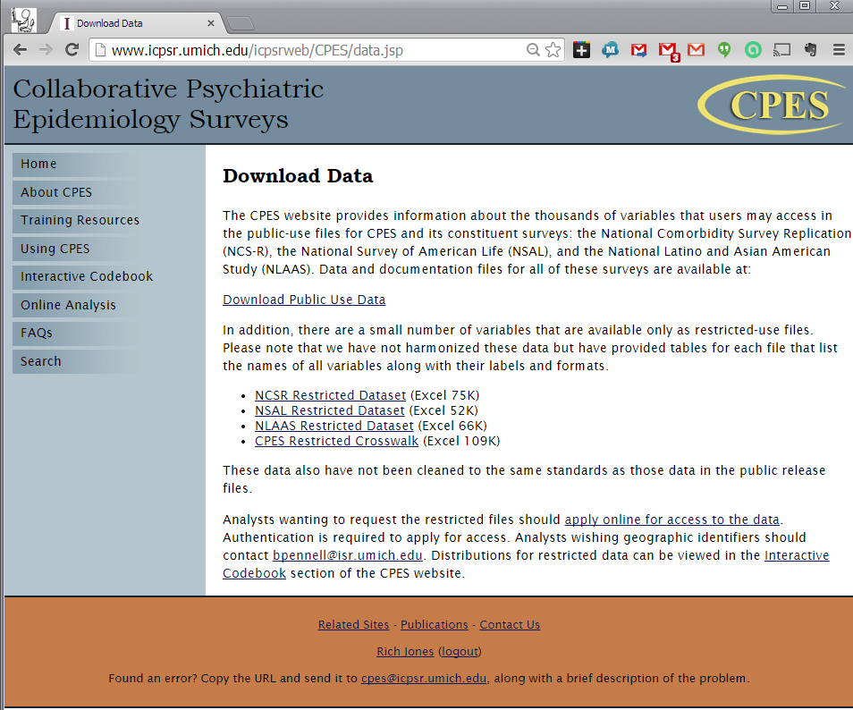
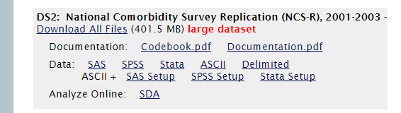

## 2014-2015 presentation series: Switch2R

  - October 2014: R basics 
  - November 2014: Clean data with R
  - December 2014 Analysis with R
  - January 2015 Graphics with R (1/2)
  - February 2015: Graphics with R (2/2)
  - March 2015 Reproducible research with R (Dale)
  - April 2015: GIS with R 
  - May 2015: Power and sample size
  - June, July Aug. 2015: Summer break

---

# Updates from October 2014 

  - If you are a Windows user, you should be using [Revolution R Open](http://www.revolutionanalytics.com/revolution-r-open)
    + It is much faster
    + Otherwise, no big difference from regular R
    + Integrates seamlessly with RStudio
    + A few weeks behind new R releases
  
  - If you are a Mac user, don't use Revolution R Open
 
    + Unless someone knows why you should
   
  - If you are a Mac user, there was an issue with R, RStudio with
   the Yosemite Mac OS X 10.10 update
   
    + read more about it [here](http://www.r-bloggers.com/r-and-rstudio-incompatibility-with-yosemite-mac-os-x-10-10/)
  

---

# November 2014: Clean Data with R

 - Use R to clean data
 
     + read data (review from last time)
     + make new variables
     + produce dataset documentation
     + label variables and values (sjPlot)
     
     
---

# Things to remember about R

  - There are about 57 different ways to do the same thing
  - There is undoubtedly a better way to do the things I am going to show you 
  - When you find out please share
  
---
  
# Things to remember about data in R

  - R *natively* does not support variable and value labels
  - You can load multiple data sets in R at once
  - Data can be
  
    + in *data frames*
    + in *matrix*
    + *attached* (but don't do that)
    + in a list
    
---    

# What are clean data?

  - Clean data are *tidy* data 
  - Tidy data are not *messy* data
  - Tidy data have the following characteristics
  
    + 1 variable : 1 column
    + 1 observation : 1 row
    + *Each type of observational unit forms a table*, or, 
    + data are only stored in one place (you may need different tables)
       
--- 

# Example from last month

Atkins, D. C. (2005). Using multilevel models to analyze couple 
and family treatment data: Basic and advanced issues. 
*Journal of Family Psychology*, 19, 98-110. 

Data from [UCLA IDRE](http://www.ats.ucla.edu/stat/paperexamples/atkins_mlm/default.htm)

Article: findit at Brown full text (http://goo.gl/D6m2ID)    
    
---

# R Session

 - Decide where you will do your work
 - Set the working folder
 - Download data
 - Write (and save) code
 
---

# What I do

  - I work in folder *c:/work/project-name-here*
  
```{r}
work <- "c:/work/shows/switch2r"
setwd(work)
getwd()
```

---

# Load some packages

(note: order matters)

```{r, results='hide', message=FALSE}
# install.packages("lubridate")
# install.packages("psych")
# install.packages("gmodels")
# install.packages("Hmisc")
# install.packages("sjPlot")
require(lubridate) # easy handling of dates and times
require(psych)    # using the scoreItems command 
require(Hmisc)    # using the describe command
require(sjPlot)   # tools for reading SPSS formatted data
require(gmodels)  # using the CrossTable command
```

--- 

# Read in the data set from the web

```{r}
# Read data from UCLA Web site
url <- "http://www.ats.ucla.edu/stat/paperexamples/atkins_mlm/Atkins_JFP_data.txt"
data <- read.csv(url, sep="\t", header=TRUE)
# I like all lowercase variable names
names(data)<- tolower(names(data)) 
# show the first 15 lines
head(data, 15)
```

---

# Are these data *tidy*?

  - Discuss
  
---

# Make some variables

The data file has a variable *therapy* that is coded -.5/+.5. 

Let's say I'd like to have a version of that variable that was coded 1/2. 

I'll call it *tx*

```{r}
data$tx <- 1 # New variable tx in data.frame data = 1 (by default)
data$tx[which(data$therapy==0.5)] <- 2 # if therapy == 0.5 data$tx = 2
str(data[,c("tx","therapy")]) # show the characteristics of two variables
# Now check
table(data$tx, data$therapy) # a crosstab of tx and therapy in data.frame data
```

---

# A nicer looking cross-tab

Using *CrossTable*  from the *gmodels* package

```{r}
CrossTable(data$tx, data$therapy, 
  missing.include=TRUE, 
  prop.r=FALSE, 
  prop.c=FALSE, 
  prop.t=FALSE, 
  prop.chisq=FALSE)
```

---

# But that is so cumbersome to code...

Welcome to R

```{r}
tab <- function(r,c) {
  CrossTable(r, c, 
    missing.include=TRUE, prop.r=FALSE, prop.c=FALSE, prop.t=FALSE, 
    prop.chisq=FALSE)
}

```
--- 

# Now a nice cross-tab

```{r}
tab(data$tx,data$therapy)
```

And anyway the coding looks right. But notice the variable names are
now the not-so-helpful "r" and "c". So whatever.

---

# Sex

Another example. I'll code a variable *male* from the original *sex*
```{r}
data$male <- 0 # initialize to 0
data$male[which(data$sex!=1)] <- 1 # sex is 0:Husband 1:Wife
tab(data$male,data$sex)
```
---

# About indicator variables

*male* is a binary indicator (0/1). When coding binary indicators with the
values (0/1), always code so that the name of the variable always matches
the label for value 1. For example, 

| R sex     | Categorical Variable | Binary indicator | Binary indicator |
|-----------|----------------------|------------------|------------------|
| **is really** | **Gender codes**  | **Female**      | **Male**         |
| a man     | 1 = male             | 0                | 1                |
| a woman   | 2 = female           | 1                | 0                |

---

# Dates

The example data set does not have any date information. 

Public data rarely will. 

But you will surely have to deal with dates. 

So let's pretend it has dates.

To pretend it has dates, we will generate some date data. So now you get to
see how we generate data with R.

```{r}
set.seed(3481)
data$year <- sample(1:3,nrow(data),replace=T)+2008
data$day <-  sample(1:27,nrow(data),replace=T)
data$month <- round(runif(nrow(data),0.51,12.49))
```
The first line says: make a new variable *year* in data frame *data*. *Assign* 
to it values, *sample* from the range 1 to 3, as many times as there are
*rows* in the data frame named data. Sample with replacement. Then add 2008.

The third line says: make a new variable *month* in data frame *data*. *Assign* 
to it a random numbers (as many as there are rows in the data frame) drawn from 
a uniform distribution ranging from 0.51 to 12.49. Oh but round it to the nearest
whole number too. 


---

# Display the *str*ucture of the day month year variables

```{r}
str(data[,c("day","month","year")])
```


---

# Tabulate the day month year variables

```{r}
table(data$day)
table(data$month)
table(data$year)
```

---

## Dates using lubridate

(luridate vignette)[http://cran.r-project.org/web/packages/lubridate/vignettes/lubridate.html]

---

# Some interesting things about dates

```{r}
the.time.is.now <- now()
the.time.is.now.numeric <- as.numeric(now())
the.time.is.now
the.time.is.now.numeric
as.numeric(mdy("1/1/1970"))
as.numeric(mdy("1/2/1970"))
60*60*24
str(the.time.is.now)
```

---

# Making a datetime variable

```{r}
data$year <- as.character(data$year)
data$month <- as.character(data$month)
data$day <- as.character(data$day)
data$date <- mdy(paste0(data$month,"/",data$day,"/",data$year))
head(data[,c("year","month","day","date")])
```

---

# New Example: National Comorbidity Study Replication (NCS-R 2002-2003)

Data from ICPSR (public use)

I can redistribute to Brown faculty, students, and staff (authorized users)

If you are not Brown faculty, students, and staff, see about getting access 
to the NCS-R public use files at [ICPSR](https://www.icpsr.umich.edu/)

---

# NCS-R data

I am pulling the NCS-R data as archived along with the 
Collaborative Psychiatric Epidemiology Surveys.

[CPES Website](https://www.icpsr.umich.edu/icpsrweb/CPES/index.jsp)




---

# Download the SPSS data file



---

# Let's get set

```{r}
work <- "c:/work/shows/switch2r" # my working folder you edit here
setwd(work) # change to it
getwd() # check it
```

---

# I've downloaded the SPSS file to a subfolder here (NCSR)

```{r}
dir("./NCSR")
```

---

# We'll use the sjPlot package to read in the SPSS data
 
  and generate a nice data dictionary
  
```{r, results='hide', message=FALSE}
spssdata <- sji.SPSS("./NCSR/20240-0002-Data.sav")
# sji.viewSPSS(spssdata) # opens in the Rstudio Viewer Panel
# Or in a browser window if you're running the R Console
```

---

# Let's save that codebook

```{r, results='hide', message=FALSE}
#sji.viewSPSS(spssdata, file="codebook.html", showFreq = TRUE, useViewer = FALSE)
codebookpath <- file.path(work,"codebook.html")
```
[The codebook](`r codebookpath`)

But that link only works on your (i.e., my) local computer

Viewers of this presentation can see the codebook I generated
[on my dropbox](https://dl.dropboxusercontent.com/u/458793/Switch2R/codebook.html)

---

# Let's make a summated rating scale score

Psychotic experiences

 - PS1A  Ever see vision that others couldn't see
 - PS1B  Ever hear voices others couldn't hear
 - PS1C  Ever have mind control experience
 - PS1D  Ever feel mind taken over by strange forces
 - PS1E  Ever exp communication attempts from strange forces
 - PS1F  Unjust plot to harm you/have people follow-nobody believe
 
Each coded 1=Yes, 5=No

---

# Look at the data

```{r}
psitems <- c("PS1A", "PS1B", "PS1C", "PS1D", "PS1E", "PS1F")
describe(spssdata[psitems])
```

Looks like a skip pattern

---

# Kessler says...

 - A total of 9282 respondents participated (2001-2003)
 - All respondents completed a Part I diagnostic interview (WHO-CIDI)
 - A probability sample of 5692 also received  Part II (additional disorders)
 - A random sub-sample of Part II respondents (n = 2322) was 
  administered the NAP screen
 - NAP (Non-affective psychosis)
 - Our N=2349-2353 is pretty close to that

Kessler RC, Birnbaum H, Demler O, Falloon IR, Gagnon E, Guyer M, Howes MJ, 
Kendler KS, Shi L, Walters E. The prevalence and correlates of 
nonaffective psychosis in the National Comorbidity Survey Replication
(NCS-R). [Biol Psychiatry. 2005;58(8):668-76.](http://www.ncbi.nlm.nih.gov/pmc/articles/PMC2847859/)

---

# Sum score

```{r}
key <- c(1,1,1,1,1,1) # the "right" answers
results <- scoreItems(
  items = spssdata[psitems],
  keys = key, 
  totals = TRUE, 
  missing = TRUE, # missing data are imputed
  impute = "none"  # person's non-missing mean response used for missing
  )
```

---

# Display scoreItem results

```{r}
results
```

---

# Display the **str**ucture of the *results*

```{r}
str(results)
```

---

# Tabulate missing values

```{r}
table(results$missing)
```

---

# Display the internal consistency reliability coefficient

```{r}
results$alpha
```


---

# Save alpha to two decimal places

```{r}
alpha <- round(results$alpha,2)
```

My markdown code

```{}
The internal consistency reliability coefficient for the sum of the
psychotic experiences scale is 'r alpha'.
```

The internal consistency reliability coefficient for the sum of the
psychotic experiences scale is `r alpha`.

---

# Display the structure and report the item response frequencies

```{r}
str(results$response.freq)
results$response.freq
```

---

# Add to working data file

```{r}
spssdata$pscount <- results$score 
```
---

# Review of things we accomplished today

  - Big ideas
  - Packages
  - Commands and functions
  - Skills and tasks

---

# Big ideas

 - using public data
 - tidy data
 - documentation
 - seeds

---

# Packages

 - lubridate
 - gmodels (CrossTab)
 - sjPlot (sji.SPSS and others)
 - psych

---

# Commands and functions

 - setwd, getwd
 - CrossTable (gModels)
 - sample
 - runif
 - names 
 - tolower
 - as.numeric, as.character
 - head
 - str
 - file.path
 - paste0
 - scoreItems (psych)

---

# Skills and tasks

  - install packages
  - load packages 
  - set the working directory
  - relative paths
  - read data from the internet
  - read data from SPSS/SAV file
  - refer to specific variables
  - refer to specific observations
  - made a cross tab
  - made new variables
  - generate random data
  - define a new function
  - working with dates
   
---

# Next meeting

Analysis with R

Use R to do multivariable analysis
 
   - Linear regression
   - Logistic regression
   - Survival analysis
   - Repeated measures mixed models

 Monday, December 8, 2014, 2-3pm.

